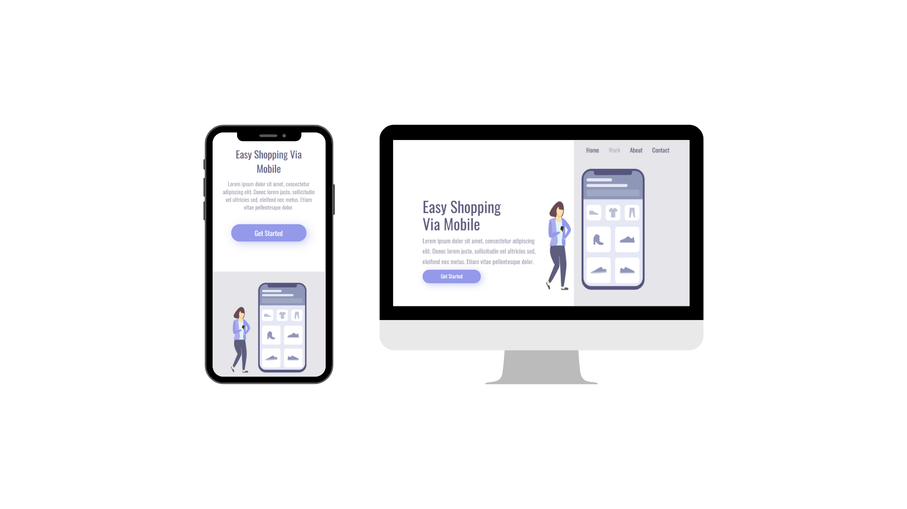

<h1 align="center">Projeto Responsivo - Easy Shopping</h1>
<div align=center">
  


</div>

<h2></h2>

# Projeto do DevClub - Aplicação Responsiva

Este é um projeto desenvolvido durante as aulas do DevClub, com base em um desafio proposto pelo professor Rodolfo Mori. A proposta foi criar uma aplicação web responsiva, ou seja, capaz de se adaptar a diferentes dispositivos, como celulares, tablets, notebooks e desktops.

## Tecnologias Utilizadas

- HTML
- CSS

## Descrição

O objetivo deste projeto foi explorar as técnicas de desenvolvimento de uma aplicação web responsiva. Ao longo das aulas, aprendemos como utilizar o HTML e o CSS para criar uma interface que se adapte de forma adequada a diferentes tamanhos de tela.

## Funcionalidades

A aplicação possui as seguintes funcionalidades:

- Responsividade: a interface se ajusta automaticamente de acordo com o tamanho da tela do dispositivo utilizado pelo usuário.
- Navegação intuitiva: os elementos da interface foram projetados de forma a facilitar a navegação e proporcionar uma experiência agradável ao usuário.

## Como utilizar

1. Clone o repositório para o seu ambiente local:
   ```
   git clone https://github.com/seu-usuario/nome-do-repositorio.git
   ```

2. Abra o arquivo `index.html` em um navegador web compatível.

3. Experimente acessar a aplicação em diferentes dispositivos ou redimensionando a janela do navegador para ver a responsividade em ação.

## Contribuição

Contribuições são bem-vindas! Caso tenha sugestões, correções de bugs ou melhorias, sinta-se à vontade para abrir uma *issue* ou enviar um *pull request*.

## Autores

- [Seu Nome](https://github.com/seu-usuario)

## Agradecimentos

Gostaríamos de agradecer ao professor Rodolfo Mori por propor o desafio e ao DevClub pelas aulas e suporte durante o desenvolvimento deste projeto.

## Licença

Este projeto está licenciado sob a [MIT License](https://opensource.org/licenses/MIT).
